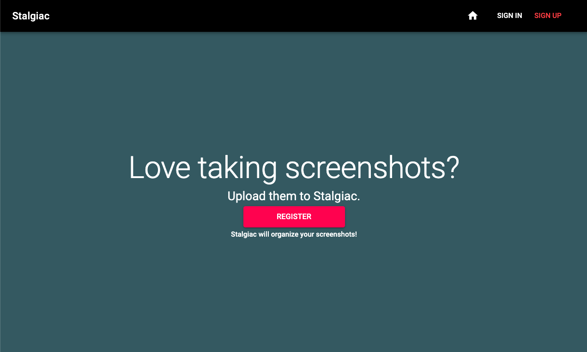
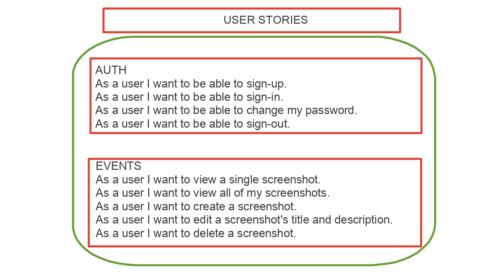
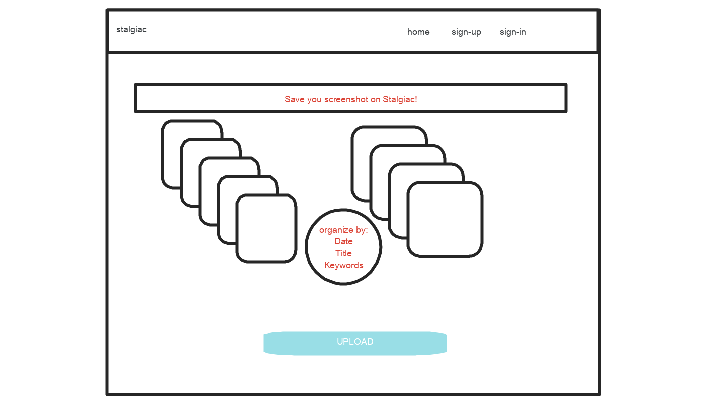
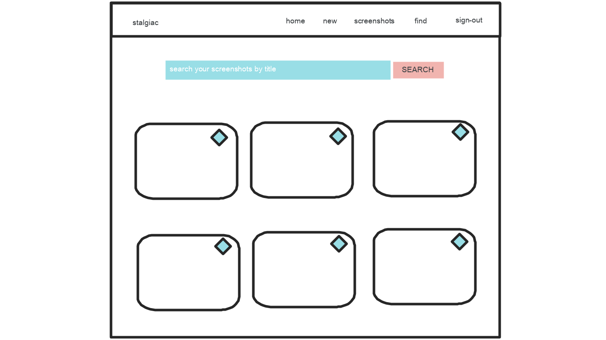

### Stalgiac
If you live by taking screenshots, or you occassionally take a few here and there, Stalgiac can help you. Screenshots are great to snap information--in the moment--that we don't want to lose; or quickly store info that we want to revisit. Storing screenshots on computers and mobile devices can be daunting, and unorganized. On mobile devices, depending on your screenshotting tendencies, it can also take up memory and lead to clutter. Que Stalgiac!  An app where you upload your screenshots, add important titles and key notes that you don't want to forget, and then once uploaded you have access to them in one organized location. Revisit and make edits to your uploaded screenshots as you wish!

### Tech used #

* React
* HTML/CSS
* Javascript
* React-Bootstrap
* Material UI
* Axios

### API Documentation #

[Stalgiac-Api](https://github.com/shanejames90/stalgiac-api)

[Stalgiac-Client-Deployed](https://www.shaneajames.com/stalgiac-client/)

[Heroku Deployed](https://stalgiac-api.herokuapp.com/)

### Planning and Organization #
Agile methods were used in the devleopment of this application. A component by component build approach was followed.

Organizational method of the project:

+ Set Up; ERD, wireframes, user stories
+ API User config
+ API route config
+ API testing/debug
+ Component Builds
+ Axios requests from client to API testing
+ Deployment using GitHub and Heroku
+ Debug
+ Final Touches

### Client View #

### User Stories #

### Wireframes #

Unauthenticated View

Authenticated View

### Set Up and Installation #
+ React version: 16.4.2
+ React-router-dom version: 4.3.1
+ Webpack version: 3.8.1
+ Material UI version: 3.9.4
+ Please see package.json for a full list of dependencies

Set up:
+ Fork and clone
+ NPM install
+ Config environment variables in src/apiConfig.js
+ src/api/auth folder contains auth requests to api
+ src/api/screenshots contains screenshot CRUD requests to api.
+ Configure routes in src/App.
+ Individual components are listes in the src/components folder.
+ Forms can be found in the src/shared folder.

### Future Plans, Problems to solve #
For future versions of Stalgiac, there a few things to implement. First off, this is somewhat trivial, however, the view for changing a password needs to be done via a modal to match sign in and sign up. Also, OCR technology will be added to search the text of uploaded screenshots.  This will allow a user to search for specific within the actual screenshot.
